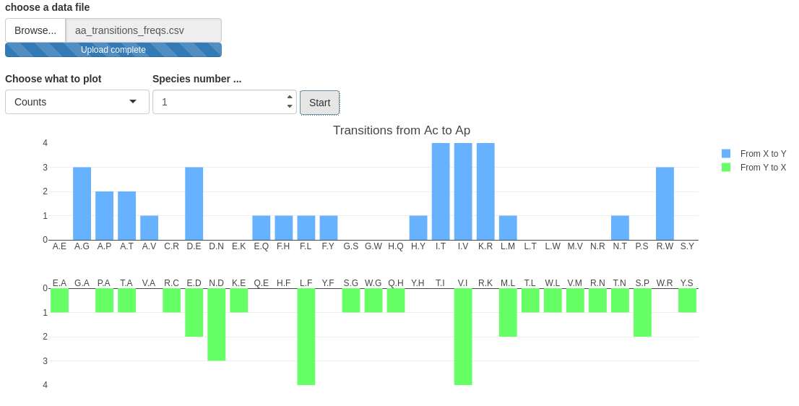

******************************
Visualization with RShiny apps
******************************

These Rshiny apps use Rplotly, in order to allows easy interactive components with the user (zooms, autoscale, hover, png export ...)

.. note:: When you export a plot from an app, do not forget to write the 'png' extension !

Required packages
=================

R 3.4.3 and rstudio

#. shiny v1.0.5
#. shinythemes v1.1.1
#. FactoMineR v1.40
#. plotly v4.7.1
#. reshape2 v1.4.3
#. ggplot2 v2.2.1

.. warning:: Be careful about conflicts between packages' versions ! The specified versions above should run without any trouble.

PCA
===

Overview
--------

This RShiny app displays PCA results (package FactoMineR) : individuals and variables plots, bi-plot, explained variance by axe plot, and PCA data tables.

Usage
-----

The user will need RStudio, if possible under a proper conda environment. Launch Rstudio, load the script and click "Run App". Then, load your data, set up the parameters and click 'Start'.

The application displays all the PCA plots in the main panel, and data tables (cos2, correlation, contribution) in secondary panels 'Individuals data' and 'variables data'

.. note:: It is planned to make the apps available on a Galaxy's instance (or maybe to build a dedicated conda environment on the cluster)

User parameters
^^^^^^^^^^^^^^^

#. data file : csv file from MutCount concatenated mode
#. What to plot : choose between counts and frequencies
#. Axis X and Axis Y : the axes to use to plot the PCA
#. Individuals and variables colors ranges : the dot for both individuals and variables plots are colored according to the values of their cos2/contribution/correlation.
#. Axis for individuals and variables color range : since every dot has a cos2/correlation/contribution for each axe, the user can choose the axe used for the colorscale. By default, the color scale is based on cos2 (individuals) and contribution (variables), both on axis 1.

.. Warning:: There is no implemented limit for the axes numbers : if the user choose an unexisting axe, an error message will be displayed.

.. Warning:: It happens regularly to have an error message for the variables plot ('*Error* : Wasn't able to determine range of domain'). It is due to a dots colorscale error : the selected attributes (cos2 or contribution) for colorscale contains 'Inf' values with are incompatible with the colorscale. If this happens, the varaibles dots colorscale will only work with the 'contribution'.

.. note:: The feature 'Hide unrepresentative data' is not implemented yet ; its purpose is to simplify heavy plots (for example codons-transitions) by hiding unrepresentative points according to the value used for the colorscale.

.. image:: _static/example_pca.png
   :align: center

Code documentation
------------------

The server function is composed by :

#. A 'data' reactive event, which takes the input file, select lines according to the user choice (counts/frequencies) and the file content (elements counts/transitions counts/ gc_counts), and computes the PCA.
#. An observe event, which displays all the PCA plots and data tables at each parameter variation.

.. todo:: Make a more classical variable plots (with the arrows) : plotly does not has an automatic way to construct PCAs.
.. todo:: Display two color code on biplots (nb : I tried, but it seems plotly has trouble to handle double color scales)
.. todo:: Display lines names (species) on data tables

FCA
===

This RShiny app displays FCA results (package FactoMineR) : CA factor map, explained variance by axe plot, and CA data tables.

Usage
=====

Similar to the PCA application, except that colors ranges have been temporarily deactivated (for the same reason than with PCA bi-plot).

Code documentation
------------------

Similar to the PCA application.

Elements transitions between couples of species
===============================================

Overview
--------

usage
-----

The user will need RStudio, if possible under a proper conda environment. Launch Rstudio, load the script and click "Run App". Then, load your data, set up the parameters and click 'Start'.

There is one figure per couple of species, each figure containing two barplots :

#. Above, the number (or frequencies) of transitions from element X to element Y, from species A to species B
#. Below, the number (or frequencies) of transitions from element Y to element X, still from species A to species B

The image autoadjusts to the windows' size, and displays only existing transitions : if for a couple of elements X and Y, there are no transitions, it is removed from the xaxis. Plots are constructed in a way that the two directions of a possible transitions between two elements are always displayed one above the other.

.. note:: It is planned to make the apps available on a Galaxy's instance (or maybe to build a dedicated conda environment on the cluster).

.. note:: When studying codons transitions, the plots might become too dense, even if not displaying non-existing transitions.

User parameters
^^^^^^^^^^^^^^^

#. data : csv file from MutCount concatenated mode
#. What to plot : choose between counts and frequencies
#. Species number : each species couple transitions has a numeric key (which actually corresponds to it's line number in the output file).

Code documentation
------------------

The server function is composed by :

#. A 'data' reactive event, which takes the input file and reorders columns in order to plot transitions at the right place (transition X->Y above transition Y->X). This step also skips transitions of type X -> X (i.e conserved elements). The column reordering follows a pattern proper to each input file
#. An observe event, which displays the plot at each parameter variation. The input data goes throught several preprocessing (lines selection and renaming, melting with reshape2, splitting in above and below plots ...) and then is sent to a renderPlotly function, which constructs a plotly object.

.. todo:: It would be good to replace the species numbers by the species couples names
.. todo:: Make the pvalues appear on the plot (nb : I tried, but it seems plotly has trouble to handle sublplots)

Training
========

Shiny

`Official tutorial <http://rstudio.github.io/shiny/tutorial/>`_

`A GitHub Tutorial <https://shiny.rstudio.com/tutorial/>`_

`Articles <https://shiny.rstudio.com/articles/>`_

plotly (nb : plotly also exists as a Python package)

`Official tutorial <https://plot.ly/r/>`_

`Book <https://plotly-book.cpsievert.me/>`_

`Plotly with Shiny tutorial <https://plot.ly/r/shiny-tutorial/>`_